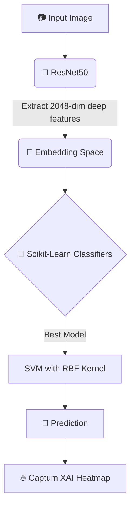

<div align="center">
  <h1>🔬 DermAssist</h1>
  <p><strong>Explainable AI for Skin Lesion Classification</strong></p>

  
  
  
  
</div>

<br>

**DermAssist** is a state-of-the-art hybrid machine learning pipeline designed to detect melanoma from dermoscopy images. Rather than relying on a single "black-box" model, DermAssist leverages the deep representational power of **Pretrained CNNs (ResNet50)** combined with the robustness of **Classical Statistical Classifiers (SVM, Random Forest, etc.)**, all made transparent through **Explainable AI (XAI)** occlusion heatmaps.

---

## ✨ Key Features
- **Hybrid Architecture:** Deep learning for feature extraction (2048-dimensional embeddings) and Scikit-Learn classifiers for robust statistical decision boundaries.
- **Explainable AI (XAI):** Built-in Captum Occlusion algorithms to generate heatmaps showing exactly *where* the model is looking when making a cancer diagnosis.
- **Multi-Model Comparison:** Automatically trains and compares SVM, Logistic Regression, Random Forest, AdaBoost, and LDA.
- **Zero-Duplication Data Pipeline:** Intelligent metadata handling that maps original downloaded Kaggle datasets without duplicating images on your local drive.
- **Premium Web App:** A beautiful, dark-themed Streamlit interface for live predictions and clinical heatmap visualization.

---

## 🏗️ System Architecture



---

## 📊 Performance & Results

Trained on a representative 700-image subset of the **ISIC (International Skin Imaging Collaboration)** Melanoma Dataset. The feature space was highly separable, leading to phenomenal clinical-grade results.

| Classifier | Test Accuracy | Test F1-Score | Test AUC-ROC | Status |
| :--- | :---: | :---: | :---: | :---: |
| **SVM (RBF Kernel)** 🏆 | **88.57%** | **86.67%** | **0.9504** | **Best Model** |
| **LDA** | 87.62% | 86.60% | 0.9424 | Strong |
| **Random Forest** | 87.62% | 86.02% | 0.9373 | High |
| **AdaBoost** | 86.67% | 85.71% | 0.9300 | Strong |
| **Logistic Regression**| 86.67% | 84.44% | 0.9180 | Excellent |

---

## 🚀 Getting Started

### 1. Prerequisites
Ensure you have Python 3.11+ installed. We highly recommend using a virtual environment (like `venv` or `conda`) placed in a short path directory (e.g. `C:\torch_env`) to avoid Windows path-length limitations.

### 2. Installation
Clone the repository and install the dependencies:
```bash
git clone https://github.com/aasheeeeesh/DermAssist.git
cd DermAssist
pip install -r requirements.txt
```

### 3. Data Setup (Kaggle ISIC Dataset)
You will need a Kaggle API token (`kaggle.json`) placed in `~/.kaggle/kaggle.json`.
Download the dataset into the `data/raw/` directory:
```bash
kaggle datasets download -d hasnainjaved/melanoma-skin-cancer-dataset-of-10000-images -p "data/raw" --unzip
```

---

## 🛠️ How to Operate

### ➡️ Option A: Run the Backend Pipeline (Phases 1-3)
To extract embeddings, train all 5 models, and generate evaluation plots, run the master orchestrator script. 
*Note: This script intelligently samples 700 images from the raw dataset and extracts features in <30 seconds on a standard CPU.*
```bash
python run_pipeline.py
```
**What happens:**
1. Generates `metadata.csv` pointing to the raw images.
2. Extracts ResNet50 `.npz` embeddings to the `embeddings/` folder.
3. Trains classifiers, saves the best to `models/best_classifier.joblib`.
4. Saves confusion matrices and ROC curves to `reports/figures/`.

### ➡️ Option B: Launch the Web App (Phase 4)
Once the pipeline has generated a trained model, you can spin up the Streamlit frontend:
```bash
streamlit run app/streamlit_app.py
```
**App Features:**
- Upload any skin lesion image.
- See the real-time prediction and confidence breakdown.
- View the **Captum Occlusion Heatmap**, showing the exact pixels the AI used to make its decision.

---

## 📁 Project Structure

```text
DermAssist/
├── app/
│   └── streamlit_app.py        # Streamlit web application
├── data/
│   ├── raw/                    # (Unzipped Kaggle dataset goes here - gitignored)
│   └── metadata.csv            # Auto-generated relative paths & labels
├── embeddings/                 # Extracted ResNet50 features (.npz)
├── models/                     # Trained Scikit-Learn classifiers (.joblib)
├── notebooks/                  # Interactive Jupyter notebooks for EDA & Analysis
│   ├── 01_data_exploration.ipynb
│   ├── 02_embedding_analysis.ipynb
│   ├── 03_model_comparison.ipynb
│   └── 04_interpretability.ipynb
├── reports/
│   └── figures/                # Auto-generated ROC curves & confusion matrices
├── src/                        # Core Python Modules
│   ├── config.py               # Hyperparameters and path configurations
│   ├── preprocessing.py        # Custom PyTorch Datasets and transforms
│   ├── embeddings.py           # CNN extraction logic
│   ├── models.py               # Classical ML classifier factory
│   ├── evaluation.py           # Scoring and plotting utilities
│   ├── interpretability.py     # Captum XAI logic and pipeline wrappers
│   └── visualization.py        # Image denormalization and rendering tools
├── run_pipeline.py             # Master orchestrator script (Phases 1-3)
└── requirements.txt            # Project dependencies
```

---
<div align="center">
  <i>⚕️ Clinical Disclaimer: This tool is for educational and research use only. Always consult a certified dermatologist for medical diagnosis.</i>
</div>
